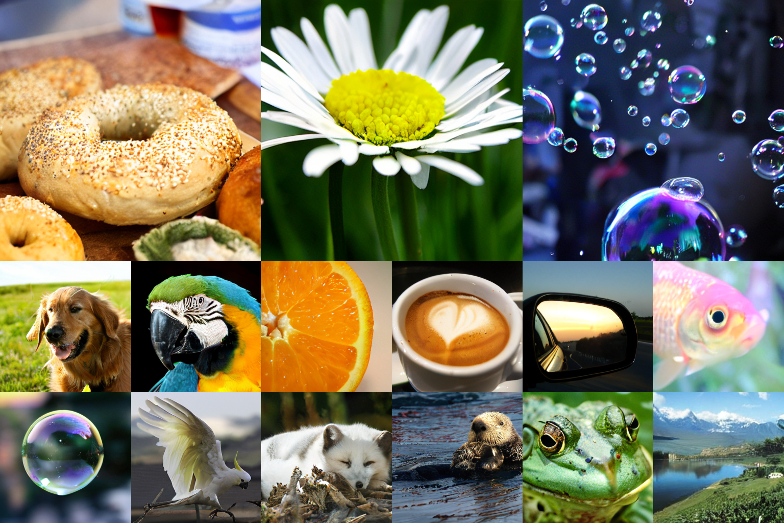
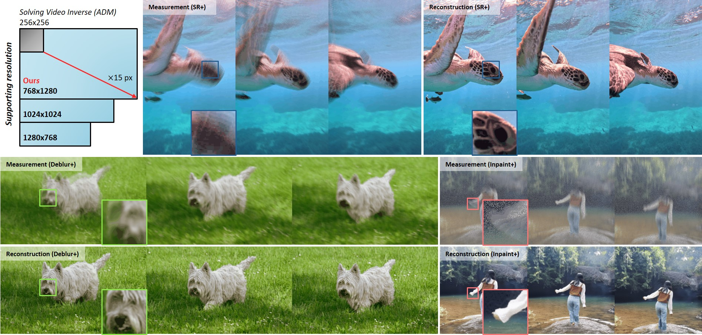
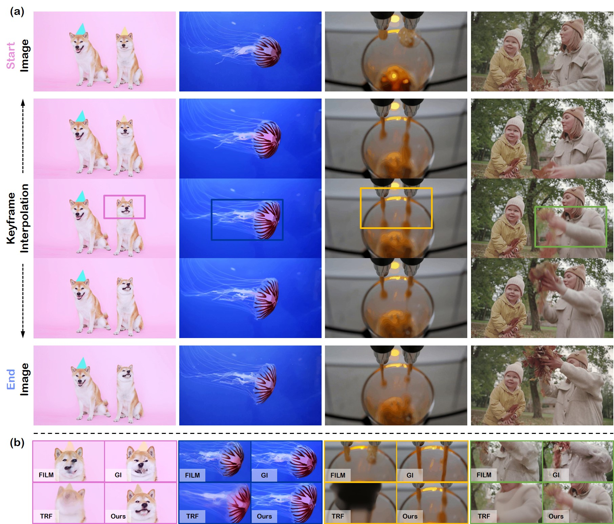
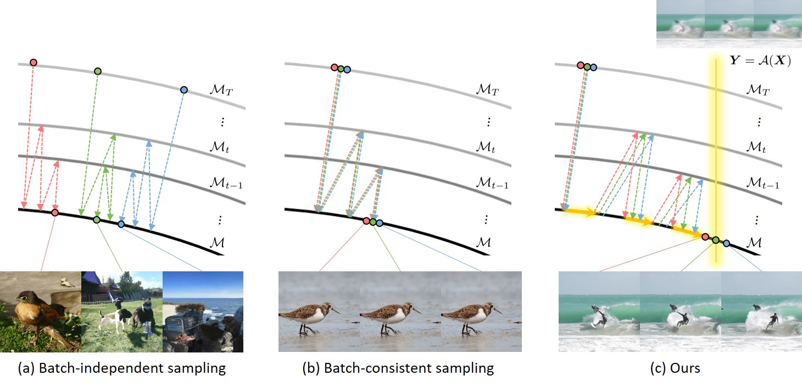
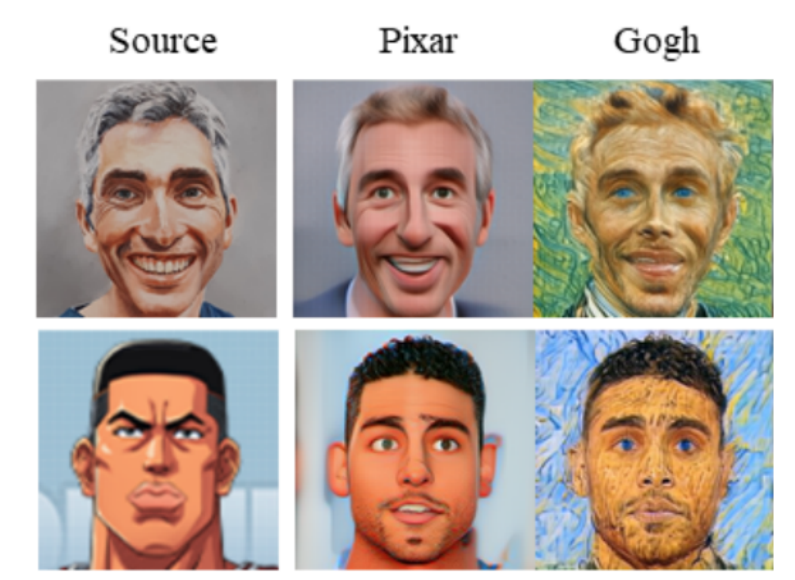
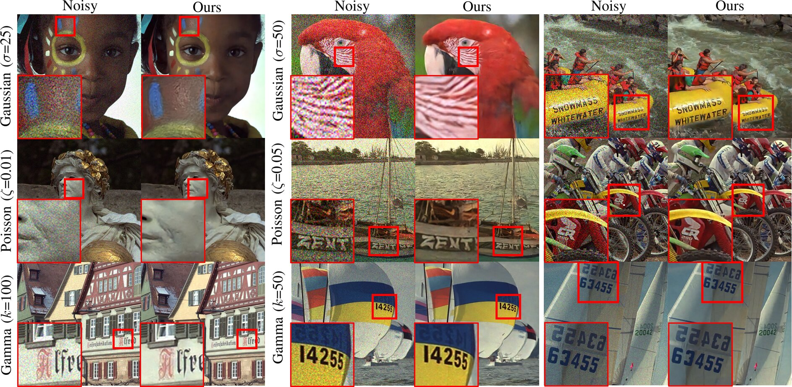
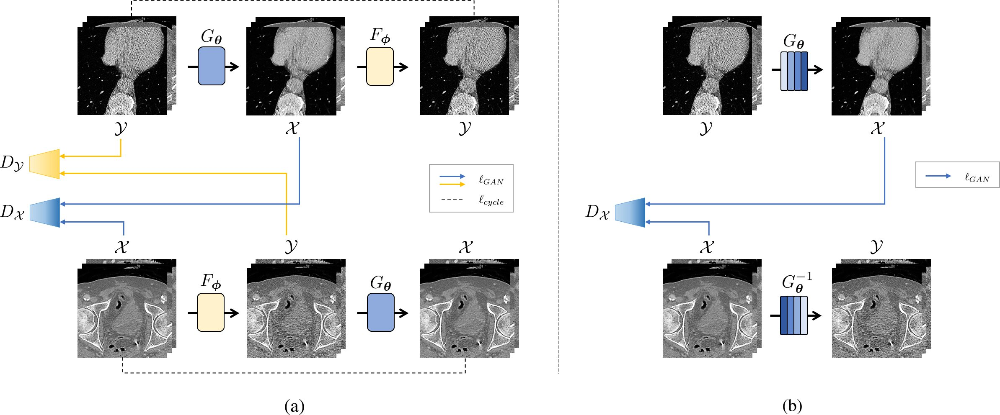

## Welcome!
I am a Postdoctoral Researcher at the Graduate School of AI at Korea Advanced Institute of Science and Technology (KAIST).
Currently, I am supported by the Sejong Science Fellowship (500 million KRW / ~$350k) to lead research on efficient generative modeling.
I completed my Ph.D. in Bio and Brain Engineering (BBE) at KAIST, co-advised by Prof. [Jong Chul Ye](https://bispl.weebly.com/professor.html) and Prof. [Mooseok Jang](https://mooolab.kaist.ac.kr/People.html).
I earned my M.S. and B.S. degrees in BBE at KAIST, advised by Prof. [Jong Chul Ye](https://bispl.weebly.com/professor.html) and Prof. [Yoonkey Nam](https://neuros.kaist.ac.kr/yoonkeynam.html), respectively.

## Experience
- **KAIST AI**, [InnoCORE](https://www.nature.com/naturecareers/employer/ba9b6a0c-bea2-4e0b-a630-40962f29cda4/kaist/hub) Postdoctoral Reseacher
   
  Advisor: Prof. [Jong Chul Ye](https://bispl.weebly.com/professor.html)
   
  Mar 2026 - Current, Seoul, Korea
- **Disney Research**, Research Intern
   
  Mentor: [Vinicius Azevedo](https://studios.disneyresearch.com/people/vinicius-da-costa-de-azevedo/)
   
  May 2025 - Aug. 2025, Zürich, Switzerland
- **ETH Zürich**, Visiting Researcher
   
  Joint research program with Disney Research
   
  May 2025 - Aug. 2025, Zürich, Switzerland

## Research Interests
My research aims to advance **efficient generative modeling** for **sustainable spatial intelligence**. I pursue this through two core directions:

  - **Efficient Generative Modeling:** Designing efficient frameworks for generative models.
  - **Generative Priors as Spatial Intelligence:** Leveraging generative models to solve diverse problems, such as video restoration, video interpolation, and 4D video generation.

## <b style="color:#F88017">Recent News</b>
- **[2026.03]** I am selected as a recipient of Sejong Science Fellowship (500 million KRW / ~$350k).
- **[2026.03]** I joined [KAIST AI](https://gsai.kaist.ac.kr/) as a Postdoctoral Researcher.
- **[2026.02]** 2 papers (*FCDM* - main, *Zero4D* - findings) are accepted to [CVPR 2026](https://cvpr.thecvf.com/Conferences/2026/).
- **[2025.08]** A paper (*VDPS*) is accepted to [TPAMI](https://www.computer.org/csdl/journal/tp).
- **[2025.06]** A paper (*VISION-XL*) is accepted to [ICCV 2025](https://iccv.thecvf.com/).
- **[2025.05]** I joined [Disney Research](https://studios.disneyresearch.com/) as a Research Intern.
- **[2025.01]** 2 papers (*SVI*, *ViBiDSampler*) are accepted to [ICLR 2025](https://iclr.cc/Conferences/2025/).

## Research

<ol class="bibliography">

<li>

  

    
    <abbr class="badge">CVPR</abbr>
  

  

      
Reviving ConvNeXt for Efficient Convolutional Diffusion Models

      
<strong>Taesung Kwon</strong>, L. Bianchi, L. Wittke, F. Watine, F. Carrara, J. C. Ye, R. Weber, V. Azevedo

    
<em><strong>CVPR 2026</strong></em>
      

    <!-- 

      <a href="https://arxiv.org/pdf/XXXX.XXXXX" class="btn btn-sm z-depth-0" role="button" target="_blank" style="font-size:12px;">PDF</a>
    
 -->
  

</li>

<li>

  

    
    <abbr class="badge">CVPR Findings</abbr>
  

  

      
<a href="https://arxiv.org/abs/2503.22622">Zero4D: Training-Free 4D Video Generation From Single Video Using
Off-the-Shelf Video Diffusion Models</a>

      
J. Park, <strong>Taesung Kwon</strong>, J. C. Ye

    
<em><strong>CVPR 2026</strong></em>
      

    

      <a href="https://arxiv.org/pdf/2503.22622" class="btn btn-sm z-depth-0" role="button" target="_blank" style="font-size:12px;">PDF</a>
      <a href="https://zero4dvid.github.io/" class="btn btn-sm z-depth-0" role="button" target="_blank" style="font-size:12px;">Project page</a>
    

  

</li>

<li>

  

    
    <abbr class="badge">ICCV</abbr>
  

  

      
<a href="https://openaccess.thecvf.com/content/ICCV2025/papers/Kwon_VISION-XL_High_Definition_Video_Inverse_Problem_Solver_using_Latent_Image_ICCV_2025_paper.pdf">VISION-XL: High Definition Video Inverse Problem Solver using Latent Diffusion Models</a>

      
<strong>Taesung Kwon</strong>, J. C. Ye

    
<em><strong>ICCV 2025</strong></em>
      

    

      <a href="https://openaccess.thecvf.com/content/ICCV2025/papers/Kwon_VISION-XL_High_Definition_Video_Inverse_Problem_Solver_using_Latent_Image_ICCV_2025_paper.pdf" class="btn btn-sm z-depth-0" role="button" target="_blank" style="font-size:12px;">PDF</a>
      <a href="https://vision-xl.github.io/" class="btn btn-sm z-depth-0" role="button" target="_blank" style="font-size:12px;">Project page</a>
      <a href="https://github.com/vision-xl/codes" class="btn btn-sm z-depth-0" role="button" target="_blank" style="font-size:12px;">Code</a>
    

  

</li>

<li>

  

    
    <abbr class="badge">ICLR</abbr>
  

  

      
<a href="https://arxiv.org/abs/2410.05651">ViBiDSampler: Enhancing Video Interpolation Using Bidirectional Diffusion Sampler</a>

      
S. Yang*, <strong>Taesung Kwon*</strong>, J. C. Ye <strong>(*co-first)</strong> 

      
<em><strong>ICLR 2025</strong></em>
      

    

      <a href="https://arxiv.org/pdf/2410.05651" class="btn btn-sm z-depth-0" role="button" target="_blank" style="font-size:12px;">PDF</a>
      <a href="https://vibidsampler.github.io/" class="btn btn-sm z-depth-0" role="button" target="_blank" style="font-size:12px;">Project page</a>
      <a href="https://github.com/vibidsampler/vibid" class="btn btn-sm z-depth-0" role="button" target="_blank" style="font-size:12px;">Code</a>
    

  

</li>

<li>

  

    
    <abbr class="badge">ICLR</abbr>
  

  

      
<a href="https://arxiv.org/abs/2409.02574">Solving Video Inverse Problems Using Image Diffusion Models</a>

      
<strong>Taesung Kwon</strong>, J. C. Ye

      
<em><strong>ICLR 2025</strong></em>
      

    

      <a href="https://arxiv.org/pdf/2409.02574" class="btn btn-sm z-depth-0" role="button" target="_blank" style="font-size:12px;">PDF</a>
      <a href="https://svi-diffusion.github.io/" class="btn btn-sm z-depth-0" role="button" target="_blank" style="font-size:12px;">Project page</a>
      <a href="https://github.com/svi-diffusion/codes" class="btn btn-sm z-depth-0" role="button" target="_blank" style="font-size:12px;">Code</a>
    

  

</li>

<li>

  

    
    <abbr class="badge">TPAMI</abbr>
  

  

      
<a href="https://ieeexplore.ieee.org/document/11123732">Video Diffusion Posterior Sampling for Seeing Beyond Dynamic Scattering Layers</a>

      
<strong>Taesung Kwon*</strong>, G. Song*, Y. Kim, J. Kim, J. C. Ye, M. Jang <strong>(*co-first)</strong> 

      
<em><strong>IEEE TPAMI</strong></em>
      

    

      <a href="https://github.com/star-kwon/VDPS" class="btn btn-sm z-depth-0" role="button" target="_blank" style="font-size:12px;">Code</a>
    

  

</li>

<li>

  

    
            <abbr class="badge">CVPR</abbr>
  

  

      
<a href="https://openaccess.thecvf.com/content/CVPR2022/papers/Kim_DiffusionCLIP_Text-Guided_Diffusion_Models_for_Robust_Image_Manipulation_CVPR_2022_paper.pdf">DiffusionCLIP: Text-Guided Diffusion Models for Robust Image Manipulation</a>

      
G. Kim, <strong>Taesung Kwon</strong>, J. C. Ye 

      
<em><strong>CVPR 2022, KCCV 2022 (Oral)</strong></em>
      

    

      <a href="https://openaccess.thecvf.com/content/CVPR2022/papers/Kim_DiffusionCLIP_Text-Guided_Diffusion_Models_for_Robust_Image_Manipulation_CVPR_2022_paper.pdf" class="btn btn-sm z-depth-0" role="button" target="_blank" style="font-size:12px;">PDF</a>
      <a href="https://github.com/gwang-kim/DiffusionCLIP" class="btn btn-sm z-depth-0" role="button" target="_blank" style="font-size:12px;">Code</a>
      <a href="https://replicate.com/gwang-kim/diffusionclip" class="btn btn-sm z-depth-0" role="button" target="_blank" style="font-size:12px;">Demo</a>
      <a href="https://github.com/gwang-kim/DiffusionCLIP" target="_blank" rel="noopener"><strong><i style="color:#e74d3c; font-weight:600" id="githubstars_manets"></i><i style="color:#e74d3c; font-weight:600"> GitHub Stars</i></strong></a>
  
    

  

</li>

<li>

  

    
    <abbr class="badge">CVPR</abbr>
  

  

      
<a href="https://openaccess.thecvf.com/content/CVPR2022/papers/Kim_Noise_Distribution_Adaptive_Self-Supervised_Image_Denoising_Using_Tweedie_Distribution_and_CVPR_2022_paper.pdf">Noise Distribution Adaptive Self-Supervised Image Denoising using Tweedie Distribution and Score Matching</a>

      
K. Kim, <strong>Taesung Kwon</strong>, J. C. Ye

      
<em><strong>CVPR 2022</strong></em>
      

    

      <a href="https://openaccess.thecvf.com/content/CVPR2022/papers/Kim_Noise_Distribution_Adaptive_Self-Supervised_Image_Denoising_Using_Tweedie_Distribution_and_CVPR_2022_paper.pdf" class="btn btn-sm z-depth-0" role="button" target="_blank" style="font-size:12px;">PDF</a>
      <a href="https://github.com/cubeyoung/NoiseAdaptive2Score" class="btn btn-sm z-depth-0" role="button" target="_blank" style="font-size:12px;">Code</a>
    

  

</li>

<li>

  

    
    <abbr class="badge">TCI</abbr>
  

  

      
<a href="https://ieeexplore.ieee.org/document/9622180">Cycle-free CycleGAN using Invertible Generator for Unsupervised Low-Dose CT Denoising</a>

      
<strong>Taesung Kwon</strong>, J. C. Ye

      
<em><strong>IEEE TCI</strong></em>
      

    

      <a href="https://github.com/star-kwon/TCI_CyclefreeCycleGAN" class="btn btn-sm z-depth-0" role="button" target="_blank" style="font-size:12px;">Code</a>
    

  

</li>

</ol>

## Patents

- **Image Generation Using Convolution Diffusion Models**
   
  **Taesung Kwon**, L. Bianchi, R. Weber, L. Wittke, F. Watine, V. Azevedo
   
  U.S. Patent, Filed, No. 19,449,217, 2026

- **Method and Apparatus for Video Restoration Beyond Dynamic Scattering Layers Using Video Diffusion Posterior Sampling**
   
  M. Jang, J. C. Ye, **Taesung Kwon**, G. Song
   
  Korean Patent, Filed, No. 10-2026-0031241, 2026

- **Method and Apparatus for Generating Intermediate Video Frames via Bidirectional Sampling**
   
  J. C. Ye, S. Yang, **Taesung Kwon**
   
  Korean Patent, Filed, No. 10-2025-0114505, 2025

- **Method and Apparatus for Solving Video Inverse Problem using Image Diffusion Models**
   
  J. C. Ye, **Taesung Kwon**
   
  Korean Patent, Filed, No. 10-2025-0171861, 2025

- **Method and Apparatus for Low-Dose X-Ray Computed Tomography Image Processing Based on Efficient Unsupervised Learning Using Invertible Neural Network**
   
  J. C. Ye, **Taesung Kwon**
   
  U.S. Patent, Granted, No. 12,346,997, 2025
   
  Korean Patent, Granted, No. 10-2643601, 2024

## Awards and Honors

- **Sejong Science Fellowship ($350,000)**, National Research Foundation of Korea, 2026 - 2031
- **KAIST Scholarship**, KAIST, 2022 - 2025
- **Korean Government Scholarship**, KAIST, 2020 - 2021
  

## Services
- **Conference reviewers:** CVPR, CVPRW, ICCV, ECCV, ICLR, ICML
- **Journal Reviewers:** IEEE TPAMI, IEEE TCI

## Media
- **Featured on YTN News:** TPAMI research on zero-shot video restoration, 2025
 
[Youtube](https://www.youtube.com/watch?v=xi39viK9ozo)

